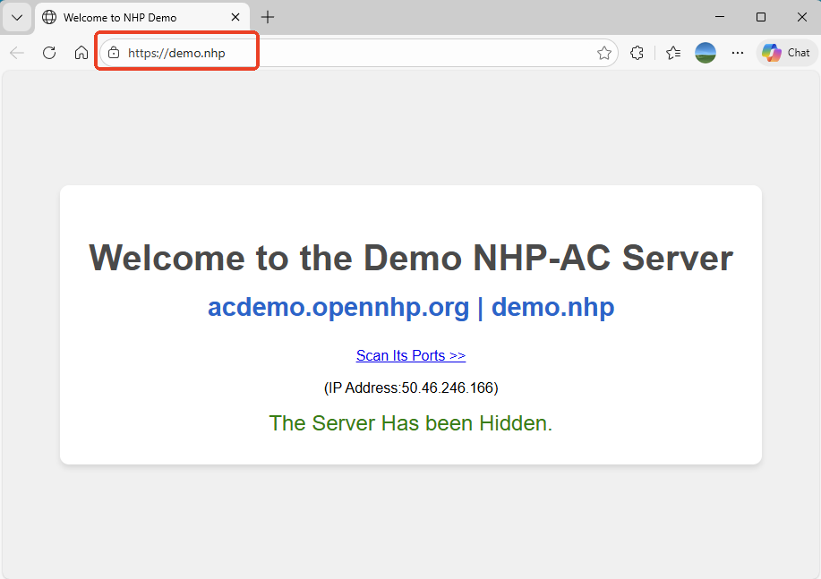
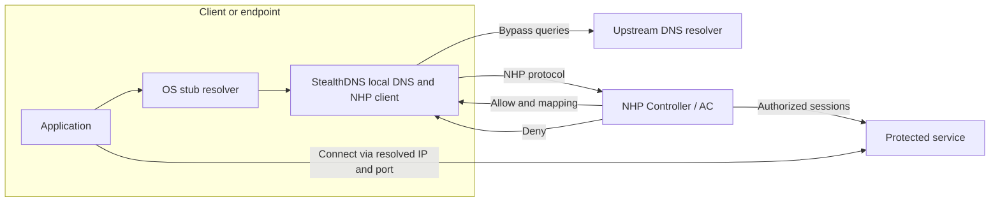
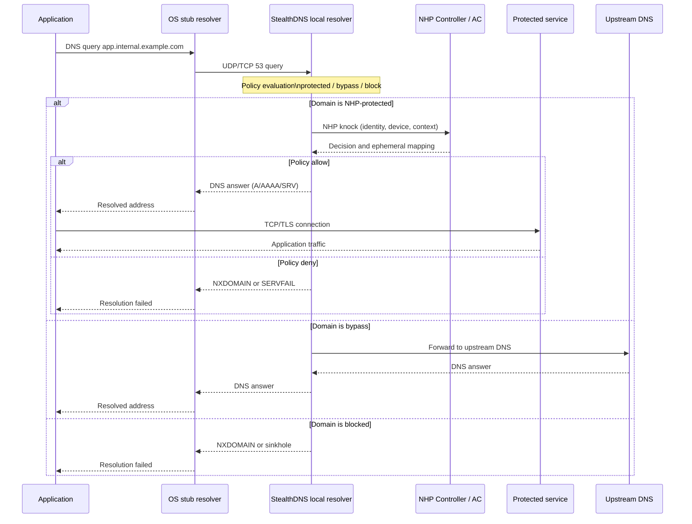

# StealthDNS

> **Local Zero Trust DNS resolver built on [OpenNHP](https://github.com/OpenNHP/opennhp).  
> Hide your network resources. Resolve only what’s earned.**

**StealthDNS** is an open source client daemon that runs as a **local DNS server** on endpoints or edge nodes.  
It intercepts DNS lookups, applies **Zero Trust policies**, and performs **NHP knocking** (Network-infrastructure Hiding Protocol) before revealing protected services.

If a client is **not authenticated / authorized**, StealthDNS makes your services effectively **invisible** on the network  
(no open ports, no valid DNS answers). When the right identity and context are present, StealthDNS returns valid records  
and allows applications to connect.

---

## ✨ Key Features

- 🛡 **Zero Trust DNS**
  - “Never trust, always verify” at the **DNS resolution step**.
  - Identity and context-aware DNS answers.

- 🕵️ **Network Infrastructure Hiding (NHP)**
  - Uses the **OpenNHP** library to perform cryptographic NHP knocking.
  - Hides IPs, ports, and even domain mappings from unauthorized clients.

- 🌐 **Transparent Local Resolver**
  - Runs on `127.0.0.1:53` (or configurable).
  - Applications use the OS default DNS settings; no app changes required.

- ⚙️ **Flexible Policy**
  - Decide which domains are:
    - **Protected by NHP** (require knocking),
    - **Directly resolved** via upstream resolvers,
    - Or **blocked** / sinkholed.

- 📦 **Drop-in for Existing Environments**
  - Works alongside traditional resolvers, DoH/DoT, or enterprise DDI.
  - Fits into SDP, Zero Trust, and NHP-based architectures.

---

## 📸 Screenshots

StealthDNS comes with a modern, intuitive desktop UI built with Wails and React.

### Status Panel
Monitor the DNS proxy service status, control service operations, and quickly access protected demo sites.

| Service Stopped | Service Running |
|:---:|:---:|
|  |  |

### Configuration
Configure client credentials and NHP server settings with an easy-to-use interface.

| Client Config | Server Config |
|:---:|:---:|
|  |  |

### Logs & Settings
View real-time logs and customize application settings including language preferences.

| Runtime Logs | Settings |
|:---:|:---:|
|  |  |

### Accessing Hidden Services
With StealthDNS running, you can access NHP-protected servers like `https://demo.nhp`. The server's domain and IP/port are completely hidden from unauthorized users - only authenticated clients can resolve and connect.

*The demo server at `https://demo.nhp` is accessible only through StealthDNS after successful NHP authentication.*

---

## 🧠 How It Works

At a high level:

1. The endpoint or server sets **StealthDNS** as its primary DNS resolver.
2. An application (browser, API client, agent, etc.) performs a DNS lookup (e.g. `app.internal.example.com`).
3. StealthDNS:
   - Checks if the domain is **NHP-protected** via local config or from an NHP/SDP controller.
   - If **not protected**, forwards the query to an upstream DNS server and returns the answer.
   - If **protected**, uses **OpenNHP** to perform an NHP “knock”:
     - Establishes a cryptographically authenticated session with the NHP Controller / Access Controller.
     - Evaluates identity, device, context (Zero Trust signals).
4. If NHP / policy evaluation **succeeds**:
   - The controller returns an **ephemeral or hidden mapping** (IP/Port/Service).
   - StealthDNS replies with valid DNS records (A/AAAA/SRV/etc.) to the application.
5. If NHP / policy evaluation **fails**:
   - StealthDNS responds with `NXDOMAIN`, `SERVFAIL`, or a configurable block response.
   - The protected service remains **invisible** (no scanable IP/port).

This enforces **identity before visibility** and **authorization before connectivity**.

---

## 🏗 Architecture Overview

### Components

- **StealthDNS Daemon**
  - Local DNS server and NHP client.
  - Implements policy evaluation, caching, logging, and metrics.

- **OpenNHP Library**
  - Implements the NHP protocol, cryptographic handshakes, and message formats.
  - Handles NHP-KNOCK, ACK, cookie, access control messages, etc.

- **NHP Controller / Access Control (AC)**
  - Central Zero Trust policy decision point.
  - Issues decisions and ephemeral mappings for protected services.

- **Protected Services**
  - Application servers, APIs, IoT/OT devices, or internal apps hidden behind NHP.

### Sequence Diagram

